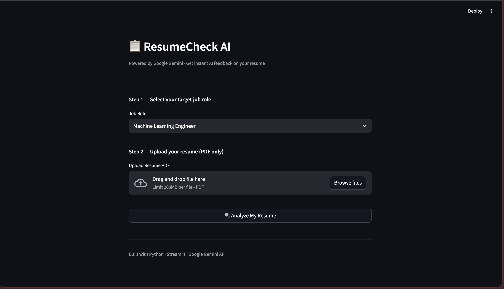
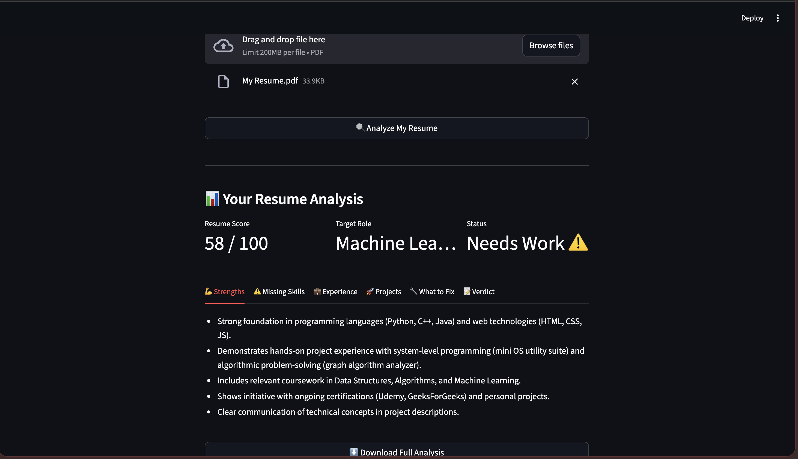

# 📋 ResumeCheck AI — AI-Powered Resume Analyzer

An AI-powered web application that analyzes your resume and gives detailed, role-specific feedback using Mistral AI. Built with Python and Streamlit.

🔗 **Live Demo:** [https://ai--resume-sfyffo5d5ge98huunk9xxf.streamlit.app/]

---

## 📸 Screenshots

### Input Form
> Take a screenshot of the form and save as `screenshots/app-form.png`



### Analysis Result
> Take a screenshot of the results with tabs and save as `screenshots/app-result.png`



---

## 💡 Features

- 📄 Upload resume as **PDF**
- 🎯 Select from **10 target job roles**
- 🤖 **Mistral AI** analyzes your resume instantly
- 📊 Get a **score out of 100** with color-coded status
- 🗂️ Results organized in **6 tabs** — easy to read
- ⬇️ **Download** the full analysis as a `.txt` file

---

## 🗂️ Analysis Sections

| Tab | What You Get |
|-----|-------------|
| 💪 Strengths | What's working well in your resume |
| ⚠️ Missing Skills | Skills you need to add for the role |
| 💼 Experience | Feedback on your experience section |
| 🚀 Projects | Feedback on your projects section |
| 🔧 What to Fix | 4–5 actionable improvement steps |
| 📝 Verdict | Overall readiness summary |

---

## 🛠️ Tech Stack

| Technology | Usage |
|-----------|-------|
| Python | Core language |
| Streamlit | Web app framework |
| Mistral AI | AI analysis (mistral-small-latest) |
| pdfplumber | PDF text extraction |
| python-dotenv | API key management |

---

## 📁 Project Structure

```
AI-resume/
│
├── app.py                 # Main Streamlit application
├── requirements.txt       # Python dependencies
├── .env                   # API key — never push this!
├── .env.example           # Template for API key
├── .gitignore             # Ignores .env and other files
├── screenshots/           # App screenshots for README
└── README.md
```

---

## ⚙️ How to Run Locally

### 1. Clone the repository
```bash
git clone https://github.com/Rudrasharma2206/AI-resume.git
cd AI-resume
```

### 2. Install dependencies
```bash
pip install -r requirements.txt
```

### 3. Get a free Mistral API key
- Go to [console.mistral.ai](https://console.mistral.ai)
- Sign up for a free account
- Go to **API Keys** → **Create new key**
- Copy the key

### 4. Set up your API key
Create a `.env` file in the project root:
```
MISTRAL_API_KEY=your_api_key_here
```

### 5. Run the app
```bash
streamlit run app.py
```

### 6. Open in browser
```
http://localhost:8501
```

---

## 📦 Requirements

```
streamlit
mistralai
pdfplumber
python-dotenv
```

Install all at once:
```bash
pip install -r requirements.txt
```

---

## 🔒 Keep Your API Key Safe

- **Never push `.env` to GitHub**
- The `.gitignore` already excludes it
- Use `.env.example` to show others what keys are needed:

```
MISTRAL_API_KEY=your_api_key_here
```

---

## 🚀 Deploy on Streamlit Cloud (Free)

1. Push your code to GitHub (without `.env`)
2. Go to [share.streamlit.io](https://share.streamlit.io)
3. Connect your GitHub repo
4. Go to **Settings → Secrets** and add:
```toml
MISTRAL_API_KEY = "your_api_key_here"
```
5. Click **Deploy** — you get a free public URL ✅

---

## 🔮 Future Improvements

- [ ] Support DOCX resume uploads
- [ ] Add job description input for ATS scoring
- [ ] Compare resume against a job description
- [ ] Add LinkedIn profile URL analysis
- [ ] Multi-language resume support

---

## 👤 Author

**Rudra Sharma**
- GitHub: [@Rudrasharma2206](https://github.com/Rudrasharma2206)
- LinkedIn: [www.linkedin.com/in/rudra-sharma-336a07322
]

---

## 📄 License

This project is licensed under the MIT License.